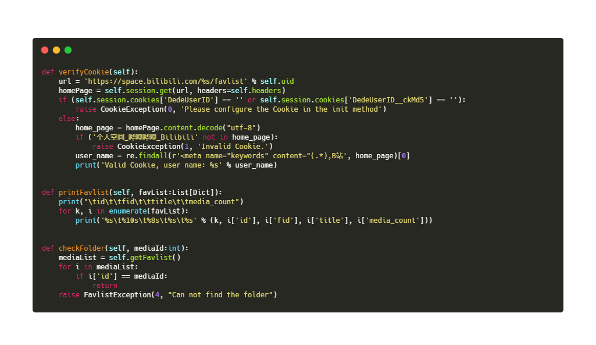

# autoBilibili
使用 python 构建一个辅助自动化管理 bilibili 的 package。

部分内容展示：



## 自动登陆 Bilibili
首先需要获取账户的 Cookie，此功能暂时还在完善中，可以使用 [哔哩哔哩粉丝牌助手](https://xiaomiku01.github.io/bili-live-heart/Guide/Cookie.html#%E7%AC%AC%E4%B8%80%E6%AD%A5-%E4%B8%8B%E8%BD%BD%E5%B7%A5%E5%85%B7) 获取。

将 Cookie 信息填入一个配置文件 config.json 中，文件需要以下字段：

```json
{
    "uid": "",
    "ckMd5": "",
    "Expires": "",
    "SESSDATA": "",
    "bili_jct": "",
    "LIVE_BUVID": ""
}
```

可通过如下代码验证 Cookie 是否配置正确

```python
bili = BiliFavlist("config_path")
bili.verify_cookie()
```
如果配置完善，则程序会打印 "Valid Cookie, user name: + 用户名"

# 文档

## 1. 收藏夹
### 1.1 获取收藏夹列表 & 打印
**函数声明：**`get_favlist(self) -> List[Dict]`

返回值：一个 list，元素是 dict，包含了每个收藏夹的信息。

**函数声明：**`print_favlist(self, favList:List[Dict]=None)`

参数：
- `favList`：获取到的收藏夹列表，是一个 list，元素是 dict 包含了每个收藏夹的信息，如果为 None，则默认打印原先 get 到的列表，或者重新 get


### 1.2 新建收藏夹
**函数声明：**`add_folder(self, name:str="", intro:str="", privacy:int=0, cover:str="")`
 
参数：
- `name`：收藏夹的名字，不能为空
- `intro`：收藏夹简介
- `privacy`：可见性，0 代表公开，1 代表私密
- `cover`：收藏夹封面，需要是图片链接


### 1.3 删除收藏夹
**函数声明：**`del_folder(self, mediaId:int)`

参数：
- `mediaId`：收藏夹 id


### 1.4 获取收藏夹信息 & 修改信息
**函数声明：**`get_folder_info(self, mediaId:int) -> Dict`

参数：
- `mediaId`：收藏夹 id

返回值：一个字典，包含了该收藏夹的详细信息

**函数声明：**`change_folder(self, mediaId:int, title:str=None, intro:str=None, cover:str=None)`

参数：
- `mediaId`：要修改信息的收藏夹 id
- `title`：修改后的收藏夹名。为空则表示不修改，下同。
- `intro`：修改后的简介
- `cover`：修改后的封面图片链接


### 1.5 移动收藏夹
**函数声明：**`move_folder(self, mediaId:int, index:int)`

参数：
- `mediaId`：要移动的收藏夹 id
- `index`：要移动到的位置。注意，这里的位置要从 1 开始，因为 0 是默认收藏夹，且列表要去掉要移动的收藏夹，也就是说，如果有 n 个收藏夹，那么 index 的取值范围是 [1, n)


---

to do:
1. 收藏夹排序
2. 对收藏的视频进行操作
---

## 2. 关注列表

### 2.1 获取关注列表 & 打印
**函数声明：**`get_folist(self, tagid:int=None, pn:int=10, ps:int=50) -> List[Dict]`

参数：
- `tagid`：关注分组的 id，如果为 None 则获取全部关注列表
- `pn`：获取的页数，从 1 开始
- `ps`：每一页的 up 主数量（ pn * ps = 总共获取多少关注的 up 主）

返回值：一个 list，元素是 dict，包含了每个关注的 up 主的信息。

**函数声明：**`print_folist(self, folist:List[Dict]=None)`

参数：
- `folist`：获取到的关注列表，是一个 list，元素是 dict 包含了每个 up 主的信息，如果为 None，则默认打印原先 get 到的列表，或者重新 get

---

to do:
1. 对关注的 up 主进行操作（取消关注、设置分组）

---

## 3. 关注分组

### 3.1 获取关注分组 & 打印
**函数声明：**`get_groups(self) -> List[Dict]`

返回值：一个 list，元素是 dict，包含了每个关注分组的信息。

**函数声明：**`print_folist(self, glst:List[Dict]=None)`

参数：
- `folist`：获取到的关注列表，是一个 list，元素是 dict 包含了每个关注分组的信息，如果为 None，则默认打印原先 get 到的列表，或者重新 get

### 3.2 新建关注分组

**函数声明：**`create_group(self, name:str)`

参数：
- `name`：新分组的名字

### 3.3 删除关注分组

**函数声明：**`delGroup(self, tagid:int)`

参数：
- `tagid`：分组 id

### 3.4 修改分组信息

**函数声明：**`change_group(self, tagid:int, name:str)`

参数：
- `tagid`：分组 id
- `name`：新的分组名字

---

## 4. 搜索视频

### 4.1 搜索视频

**函数声明：**`search_videos(self, content, num) -> List[Dict]`

参数：
- `content`：要搜索的内容
- `num`：搜索结果的数量

返回值：
一个 List，里面元素是 Dict，表示每个搜索结果的信息

### 4.2 搜索并下载

**函数声明：**`search_and_download(self, content, num, rootPath)`

参数：
- `content`：要搜索的内容
- `num`：搜索结果的数量
- `rootPath`：保存的目录

---

to do:
1. 将搜索与下载分离
2. 支持自定义视频名字 + 多 p 视频下载
